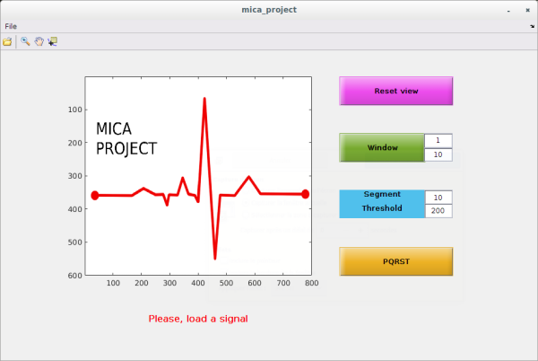
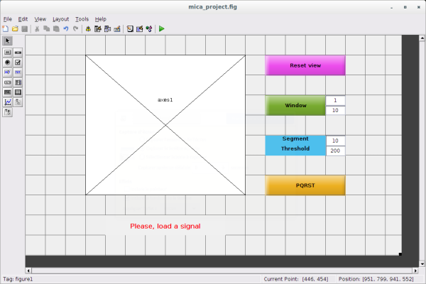

# MICA project : Matlab Implementation of a Cardiologist Assistant

This project addresses the problem of automated diagnosis of cardiac pathologies, via the signals provided by electrocardiogram (ECG) measurement devices.

The main purpose of this project is to implement basic signal processing algorithms using Matlab
to detect some cardiac pathologies, and develop a graphical user interface (GUI) to load, process and
display ECG, in order to help clinicians through their diagnosis.

This repo provides the necessary sources and informations in order to create your own GUI assistant with MATLAB.

## Getting Started

These instructions will get you a copy of the project up and running on your local machine for development and testing purposes.

### Prerequisites

You need to download the ECG signals and a simple version the assistant. On a Linux or macOS distribution, open a terminal and clone the git repo with the following command : 

```
git clone https://gitlab.com/batalinux/MICA_project.git
```

On a Windows distribution, you need to download a git client (https://git-scm.com/downloads) first.

## Files

### Your Assistant

The "mica_project.m" script contains the Matlab code for your assistant :



This first version is a GUI implementaion of the "test_threshold".m script. You can : 

* Load an ECG signal by clicking on the "open" item of toolbar : ,
* Display a windowed version of the signal by selecting a threshold,
* Find a QRS complex (see Section 3 for further details) by using a very simple threshold method and label this signal with estimated positions of P, Q, R, S, and T waves,
* Compute and display the heart rate,
* Perform unitary tests on previously defined functions with the "test_threshold.m" script inside "src" folder.

### Guide

This interface and script were generated by the Matlab GUIDE tool. You can learn how to use GUIDE at the following adress : 

* https://fr.mathworks.com/videos/creating-a-gui-with-guide-68979.html

To launch the GUIDE editor for this project, you need to type the following command in the MATLAB prompt :

```
guide mica_project
```

You should obtain a new window which looks like :



This is your GUIDE editor. You can run it by doing "tools -> run" or clicking the run button. 
It will open a new window which is your assitant !

## Your turn

Follow the instructions of the subject in order to enhance this assistant with a better interface and features.

## Authors
* **Nolwenn TAN** (nolwenn.tan@ihu-liryc.fr)
* **Baptiste LAPORTE-FAURET** (baptiste.laporte-fauret@ims-bordeaux.fr)
* **Romain TAJAN** (romain.tajan@ims-bordeaux.fr)

## License

This project is licensed under the MIT License - see the [LICENSE.md](LICENSE.md) file for details

## Acknowledgments

* ECG processing methods explained : https://www.youtube.com/watch?v=TJR2AfxVHsM

